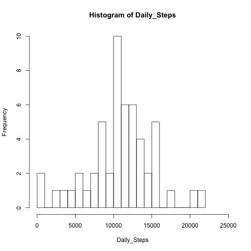
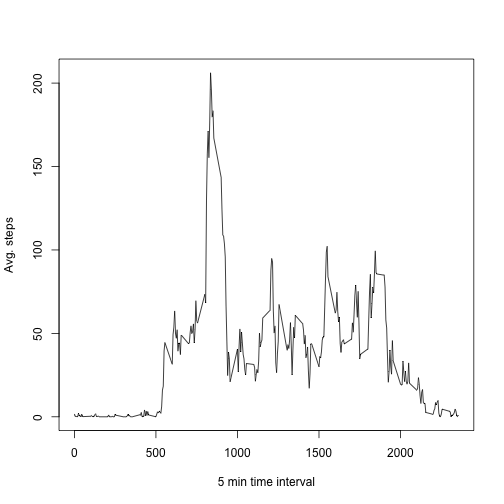
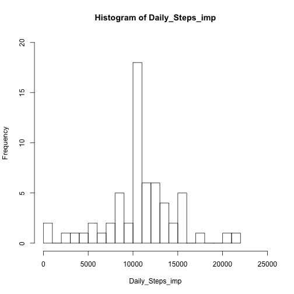
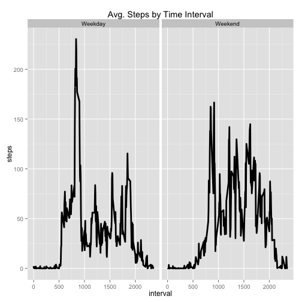

---
title: "PA1_template.Rmd"
author: "Matthew Guschwan"

# Part 1 
- Loads libraries, reads in the data, and outputs a histogram of the numbers of steps in a day.

```r
library(magrittr)
library(dplyr)
library(ggplot2)

######set directory

data <- read.csv("activity.csv")
```

```
## Warning in file(file, "rt"): cannot open file 'activity.csv': No such file
## or directory
```

```
## Error in file(file, "rt"): cannot open the connection
```

```r
d2 <- tbl_df(data)      #turns into data table 

### groups by date, then figures daily steps, then histogram

by_date <- group_by(d2, date)
sum_by_date <- summarize(by_date, Total_steps= sum(steps))
Daily_Steps <- sum_by_date$Total_steps

hist(Daily_Steps, breaks = 18, xlim = c(0,25000))                         # histogram of sum of steps
```

 

```r
(DSMean <- round(as.numeric(mean(Daily_Steps, na.rm = TRUE)), 2))   ### calculate and print the daily mean and Median
```

```
## [1] 10766.19
```

```r
(DSMedian <- as.numeric(median(Daily_Steps, na.rm = TRUE)))
```

```
## [1] 10765
```

#Part II 
-Groups the data by the 5 minute interval, then plots the average number of steps recorded in that interval.


```r
by_interval <- group_by(d2, interval)   ### organizes data by interval
avg_by_interval <- summarize(by_interval, MeanStep = mean(na.omit(steps)))
plot(avg_by_interval, type = "l", xlab= "5 min time interval", ylab = "Avg. steps")       ### plot
```

 

```r
Hi_Int <- arrange(avg_by_interval, desc(MeanStep))
print("Highest interval ")
```

```
## [1] "Highest interval "
```

```r
print(Hi_Int[1,])    ###### print out the interval with the highest avg. steps
```

```
## Source: local data frame [1 x 2]
## 
##   interval MeanStep
## 1      835 206.1698
```

#Part III 
- First counts NAs in data, then imputes a number in the place of the NA.  I chose to impute the avg for the 5 minute interval.  

```r
####count NAs in the d2 data table  then in each part
d2NAs <- sum(is.na(d2))
stepsNA <- sum(is.na(d2$steps))
dateNA <- sum(is.na(d2$date))
intervalNA <- sum(is.na(d2$interval))
## end of na counts

###  now to impute

dt_imp <- mutate(by_interval, imp = mean(steps, na.rm = TRUE))  ### create new column with mean of interval

# Replace the NAs with "imp" the imputed mean (by interval)
dt_imp$steps <- ifelse(is.na(dt_imp$steps),
                                 dt_imp$imp,       ### if true set to avg. from new column
                                 dt_imp$steps)     ####else set as before

# Remove the imputed column as it is no longer needed
dt_imp$imp <- NULL


by_date_imp <- group_by(dt_imp, date)
sum_by_date_imp <- summarize(by_date_imp, Total_Steps = sum(steps))
Daily_Steps_imp <- sum_by_date_imp$Total_Steps
hist(Daily_Steps_imp, breaks = 18, xlim = c(0,25000), ylim = c(0,20))                         # histogram of sum of steps
```

 

```r
Imean <- mean( Daily_Steps_imp)
Imedian <- median( Daily_Steps_imp  )
```
After imputing data, the mean is 1.0766189 &times; 10<sup>4</sup> and the media is 1.0766189 &times; 10<sup>4</sup>.  The mean and median are now the same, which seems strange until you consider that the numbers I imputed will add up to that average.  On the days in which there was no data recorded (NAs), that data was replaced by the average.

#Part IV 
- Create new weekday/weekend factor, and create plot that compares the number of steps during weekday vs. weekend.


```r
days <- group_by(dt_imp, date)

###  Add the weekday/weekend column "weekday_end".
ddays <- days %>% mutate(weekday_end = ( ifelse( weekdays(as.POSIXct(date)) %in% c("Saturday","Sunday"), "Weekend", "Weekday") ) )
### change column to factor
ddays$weekday_end <- as.factor(ddays$weekday_end)                      

agg <- aggregate(x = ddays$steps, by = list(ddays$interval,ddays$weekday_end), FUN = mean )
names(agg) <- c("interval","weekday_end","steps")

aggPlot <- ggplot(agg,aes(interval,steps)) +
      ggtitle("Avg. Steps by Time Interval") +
      facet_grid(. ~ weekday_end) +
      geom_line(size = 1.3)
aggPlot
```

 
The weekday steps shows a strong peak in the morning around 8:30 while the weekend steps tend to be more dispersed throughout the day.  I would guess this person walks in the morning before (or perhaps to) a job.


